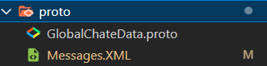

1.Protocal文件夹


csharp:存放生成的C#消息类

MessagePool:存放生成的消息池

NetGameRunning:是ChartRoom的示例消息类,不需要使用示例代码可以删除

NetSystem:是基本的两个消息类不可删除

proto:存放Proto文件



​	其中GlobalChateData是ChartRoom的示例Propro,不需要使用示例代码可以删除

​	Messages.XML将消息ID映射到消息类上

```xml
<messages>
    <message id="1" systemMessage="1" name="QuitMessage" namespace="NetSystem" />
    <message id="2" systemMessage="1" name="HeartMessage" namespace="NetSystem" />
    <!-- 以下是示例文件中的消息,不需要使用示例代码可以删除 -->
    <message id="10002" systemMessage="0" name="ChatMessage" namespace="NetGameRunning"
        datatype="NetGameRunning.GlobalChatData" />
    <message id="10003" systemMessage="0" name="EmptyMessage" namespace="NetGameRunning"
        datatype="NetGameRunning.EmptyMessageData" />
</messages>
```


