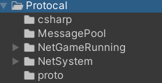
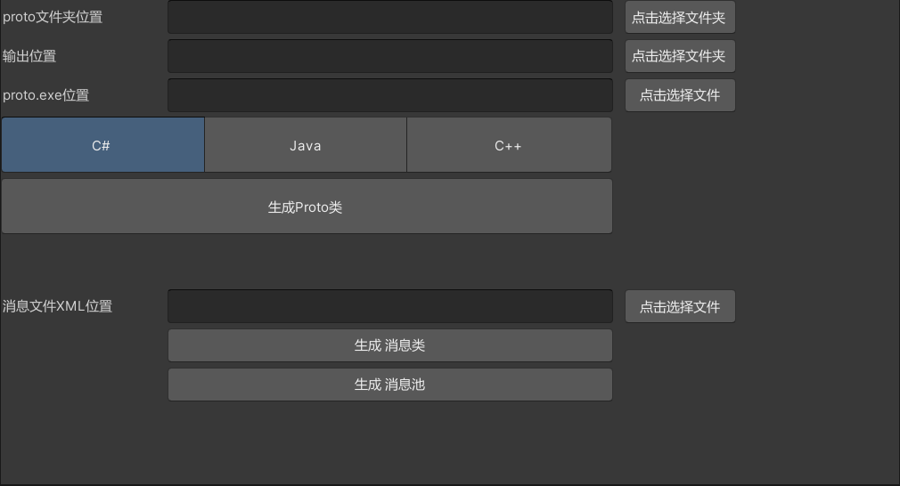
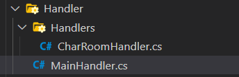

1.Protocal文件夹



csharp:存放生成的C#消息类

MessagePool:存放生成的消息池

NetGameRunning:是ChartRoom的示例消息类,不需要使用示例代码可以删除

NetSystem:是基本的两个消息类不可删除

proto:存放Proto文件


​	- 其中GlobalChateData是ChartRoom的示例Propro,不需要使用示例代码可以删除

​	-  Messages.XML将消息ID映射到消息类上

```xml
<messages>
    <message id="1" systemMessage="1" name="QuitMessage" namespace="NetSystem" />
    <message id="2" systemMessage="1" name="HeartMessage" namespace="NetSystem" />
    <!-- 以下是示例文件中的消息,不需要使用示例代码可以删除 -->
    <message id="10002" systemMessage="0" name="ChatMessage" namespace="NetGameRunning"
        datatype="NetGameRunning.GlobalChatData" />
    <message id="10003" systemMessage="0" name="EmptyMessage" namespace="NetGameRunning"
        datatype="NetGameRunning.EmptyMessageData" />
</messages>
```

2.编写消息类

如果你知道Protocal那么请使用protocal的语法编写你需要的消息类,例如:

```proto
syntax = "proto3";

package NetGameRunning;

message GlobalChatData {
    string chat_words = 1;
}

message EmptyMessageData {
    float x = 1;
    float y = 2;
    float z = 3;
    float ex = 4;
    float ey = 5;
    float ez = 6;
}
```

然后在上文提到的XML文件中编写消息类与消息ID的映射,同时将对应的命名空间填写到`namespace`,如果你要将其做为系统消息,也就是说他只需要消息ID,请将`systemMessage`填写为`1`。

3.生成消息类




请提前准备好Proto.exe文件，以便生成消息类，在此窗口选择好对应的文件后按顺序`生成Proto类`-->`生成消息类`-->`生成消息池`

4.服务器消息监听

```cs
public static void AddAllListener()
{
    ClientSocket.AddListener(MessagePool.HeartMessage_ID, HeartMessageHandler);
    ClientSocket.AddListener(MessagePool.ChatMessage_ID, CharRoomHandler.ChatMessageHandler);
    ClientSocket.AddListener(MessagePool.EmptyMessage_ID, CharRoomHandler.EmptyMessageHandler);
}
```

在`MainHandler`里的`AddAllListener`方法里添加你需要监听的消息ID和消息方法



5.客户端消息监听

利用`NetAsyncMgr.AddNetMessageListener`方法在你需要的位置添加消息监听

```cs
 NetAsyncMgr.AddNetMessageListener(MessagePool.ChatMessage_ID, (message) =>
{
    words.text += "\r\n" + (message as ChatMessage).data.ChatWords;
});
```

6发送消息

客户端和服务器均有` public void Send(BaseMessage info)`方法可以发送消息